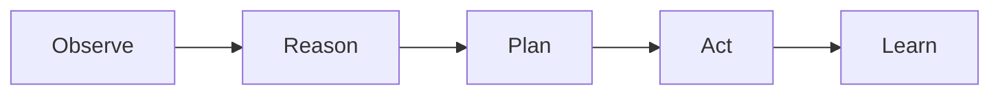

# What Are AI Agents?

AI Agents are intelligent software entities capable of:

* Perceiving information
* Reasoning about goals
* Planning actions
* Taking actions autonomously
* Learning from outcomes

## Traditional Automation vs AI Agents

| Capability          | Traditional Automation | AI Agent |
| ------------------- | ---------------------- | -------- |
| Executes Scripts    | Yes                    | Yes      |
| Learns from Results | No                     | Yes      |
| Makes Decisions     | No                     | Yes      |
| Adapts to Changes   | Limited                | High     |
| Generates New Tests | No                     | Yes      |
| Self-Healing        | Limited                | Advanced |

## Core Components

Unlike conventional automation frameworks, AI Agents continuously improve their performance through feedback loops.

---
