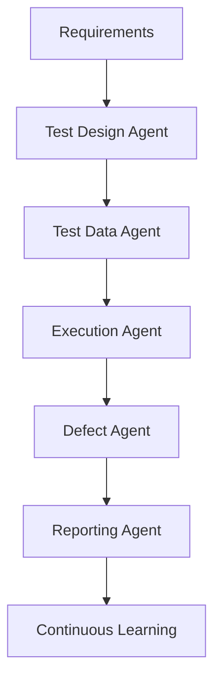

# Autonomous Testing Lifecycle

AI Agents enable end-to-end autonomous testing workflows.

## Autonomous QE Framework

## Benefits

### Faster Releases

Reduced manual effort.

### Better Coverage

AI discovers additional scenarios.

### Reduced Costs

Less maintenance overhead.

### Continuous Improvement

Learning systems improve over time.

---
