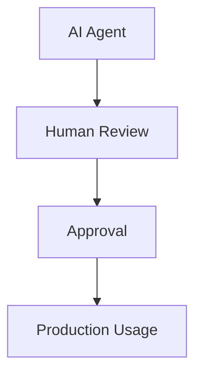

# Governance and Risks

AI Agents introduce new opportunities and risks.

## Key Risks

### Hallucinations

Incorrect outputs may impact testing.

### Compliance Concerns

AI-generated data must meet regulatory requirements.

### Explainability

Organizations must understand AI decisions.

### Security

Sensitive information must remain protected.

## Governance Framework

## Best Practices

* Human oversight
* Model validation
* Data governance
* Audit trails
* Security controls

---
